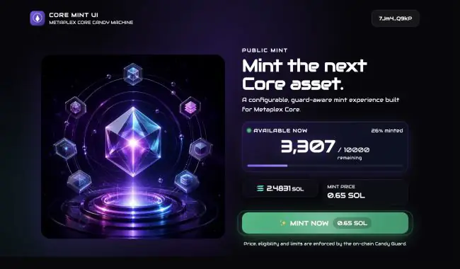
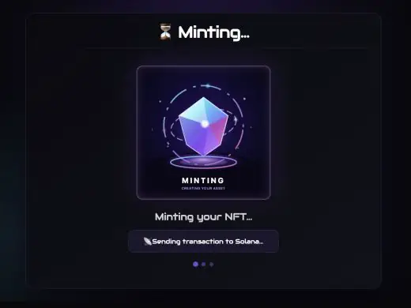
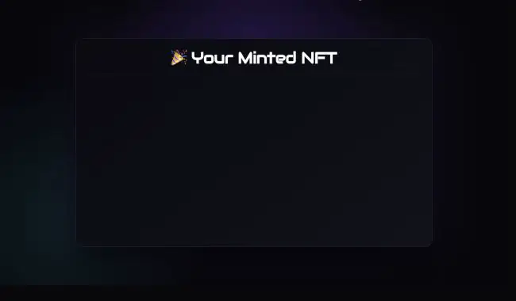

# Core Mint UI

A production-oriented, configurable mint website for **Metaplex Core Candy Machine** on Solana. It includes wallet connection, Candy Guard groups, allowlists, Core and Token Metadata gates, multi-mint, an HTTP RPC proxy, optional server-only third-party signing, recent mints, reveal UI, and authority-only administration tools.

This is a community project and is not an official Metaplex product.

## UI preview

### Mint page



### Transaction progress



### Successful reveal



These looping previews use the actual UI components with safe documentation values. They do not show a real wallet or submitted transaction. The neutral artwork is intended to be replaced for each collection; its source and generation notes are recorded in [ASSET_PROVENANCE.md](./ASSET_PROVENANCE.md).

## Before you start

This UI does not create or upload your collection automatically. You need:

- Node.js 24 and npm;
- a Solana wallet funded for the network you use;
- a deployed **Metaplex Core Collection**;
- a **Core Candy Machine** with all items inserted;
- a **Core Candy Guard** wrapped around that machine;
- an HTTPS Solana RPC endpoint with DAS support for galleries and asset-based guards.

Follow [CANDY_MACHINE_SETUP.md](./CANDY_MACHINE_SETUP.md) before configuring the website. The official [Core Candy Machine documentation](https://www.metaplex.com/docs/smart-contracts/core-candy-machine) and [MPLX CLI Candy Machine guide](https://www.metaplex.com/docs/dev-tools/cli/cm) are the source of truth for on-chain setup.

## Quick start

```bash
git clone YOUR_REPOSITORY_URL core-mint-ui
cd core-mint-ui
npm ci
cp .env.example .env.local
```

At minimum, edit these values in the ignored `.env.local`:

```env
NEXT_PUBLIC_CANDY_MACHINE_ID=YOUR_CORE_CANDY_MACHINE_ADDRESS
NEXT_PUBLIC_ENVIRONMENT=devnet
NEXT_PUBLIC_SITE_URL=http://localhost:3000/
NEXT_PUBLIC_SITE_NAME="My Collection"
RPC_URL=https://YOUR_DAS_ENABLED_RPC
RPC_REQUIRE_ORIGIN=false
MINT_REQUIRE_ORIGIN=false
```

Then run:

```bash
npm run guard:check
npm run dev
```

Open `http://localhost:3000`, connect a wallet on the same network, and test on devnet before using mainnet.

## Configure the collection

All customer-facing values are environment variables. You do not need to edit React components for a normal deployment.

- Candy Machine and network: `NEXT_PUBLIC_CANDY_MACHINE_ID`, `NEXT_PUBLIC_ENVIRONMENT`
- Branding: `NEXT_PUBLIC_SITE_*`, image/icon URLs, social links, collection information
- Appearance: `NEXT_PUBLIC_FONT_PRESET`, replaceable files in `public/`
- Mint UX: multi-mint, maximum quantity, progress duration, guard selection mode
- Short Guard labels: `NEXT_PUBLIC_GUARD_LABELS=wl:Allowlist Mint,pub:Public Mint`
- Private infrastructure: `RPC_URL` and optional third-party signer secret

See [ENV_CONFIGURATION.md](./ENV_CONFIGURATION.md) for every variable and [CUSTOMIZATION.md](./CUSTOMIZATION.md) for branding and media replacement.

## Candy Guards

The on-chain Candy Guard—not the UI—is the security boundary. Hiding a button, route, price, or phase in the browser does not enforce it.

The UI reads default Guards and named Guard groups from the configured Core Candy Machine. Set:

```env
NEXT_PUBLIC_GUARD_SELECTION_MODE=all
```

to show every eligible group, or use `best` to automatically show the cheapest eligible group. Group labels are on-chain identifiers and must be at most six UTF-8 bytes.

Implemented flows include SOL/token payments, time windows, mint limits, allowlists, SPL token gates, Token Metadata NFT gates, Metaplex Core asset gates, burns/payments, and optional third-party signing. Some advanced Guards require project-specific integration and testing. The exact support boundary is documented in [GUARD_SUPPORT.md](./GUARD_SUPPORT.md).

## Allowlists

If your Guard uses `allowList`:

1. Add wallet addresses to [allowlist.tsx](./allowlist.tsx).
2. Use a map key that exactly matches the on-chain Guard group label, or `default`.
3. Configure the on-chain Guard with the Merkle root generated from the same list.
4. Rebuild and deploy the UI.
5. Test the proof route on devnet.

The list is compiled into browser JavaScript and is therefore public. Do not place secrets in it.

## Optional third-party signer

The server-only signer is needed only when an effective `thirdPartySigner` Guard is active. The buyer and new asset sign first; `/api/mint/submit` validates the complete transaction, applies the server signature, simulates it, and submits it without revealing reusable key material.

Set one signer source:

```env
# Vercel/production: JSON byte array or base58 64-byte secret key
THIRD_PARTY_SIGNER_SECRET_KEY=

# Local alternative only
THIRD_PARTY_SIGNER_KEYPAIR_PATH=/absolute/path/to/signer.json
```

The signer does not need SOL because the buyer is the transaction payer. Its public key must match the effective `thirdPartySigner` Guard for the default configuration and every mintable group.

Audit without changing on-chain state:

```bash
npm run guard:check
npm run guard:third-party
```

The second command is dry-run by default. Applying an update additionally requires the Candy Guard authority and explicit confirmation variables described in [CANDY_MACHINE_SETUP.md](./CANDY_MACHINE_SETUP.md).

If the optional fixed developer fee is enabled, a matching third-party signer Guard is required to prevent direct clients from bypassing the website’s fee instruction.

## Administration panel

Set `NEXT_PUBLIC_ADMIN_ENABLED=true` to expose the admin button. It appears only when the connected wallet matches the on-chain Candy Machine authority. The panel can:

- create an address lookup table;
- initialize supported Guard routes such as allocation;
- display allowlist Merkle roots;
- configure the built-in public/holder dual-price groups while preserving unrelated Guards.

It intentionally does not contain a hard-coded test collection creator. Use the official MPLX CLI wizard or SDK to create and load a Core Candy Machine.

## Verification

Run before every deployment:

```bash
npm run check
npm run security:audit
npm run build
npm run guard:check
```

`guard:check` is read-only and saves a private local snapshot under `.guard-snapshots/`. See [PRODUCTION_READINESS.md](./PRODUCTION_READINESS.md) for the complete release checklist.

## Deployment

Vercel is supported, including Hobby deployments. Import the repository, set all required environment variables in Vercel, and redeploy whenever a `NEXT_PUBLIC_*` value changes. Public variables are visible in browser JavaScript; secrets must never use the `NEXT_PUBLIC_` prefix.

Use `.env.local` for local development. For Vercel, copy `.env.vercel.example` to the ignored `.env.vercel`, enter production values, and import that file under **Project Settings → Environment Variables**. Local environment files are never uploaded by Git.

The browser communicates with the same-origin `/api/rpc` proxy. Production origin checks, method allowlists, size limits, weighted rate limiting, transaction validation, and signer health checks are included. Instance-local rate limits are best-effort on serverless platforms; also configure quotas at your RPC provider or platform firewall.

Detailed deployment instructions are in [DEPLOYMENT.md](./DEPLOYMENT.md).

## Documentation

- [CANDY_MACHINE_SETUP.md](./CANDY_MACHINE_SETUP.md) — collection, Candy Machine, Guard, items, signer, and audit setup
- [ENV_CONFIGURATION.md](./ENV_CONFIGURATION.md) — complete public/private variable reference
- [GUARD_SUPPORT.md](./GUARD_SUPPORT.md) — supported Guard paths and limitations
- [CUSTOMIZATION.md](./CUSTOMIZATION.md) — branding, media, fonts, group labels, and fee disclosure
- [DEPLOYMENT.md](./DEPLOYMENT.md) — Vercel and production configuration
- [SECURITY.md](./SECURITY.md) — threat model and operational security
- [PRODUCTION_READINESS.md](./PRODUCTION_READINESS.md) — final release checklist
- [PROVENANCE.md](./PROVENANCE.md) — project origin and licensing notice
- [ASSET_PROVENANCE.md](./ASSET_PROVENANCE.md) — default artwork origin and generation prompts
- [CONTRIBUTING.md](./CONTRIBUTING.md) — development and contribution requirements

## Licensing notice

The historical upstream UI named in [PROVENANCE.md](./PROVENANCE.md) did not include an identifiable software license when reviewed. This repository is technically prepared for reuse, but public redistribution or commercial use must wait until the necessary rights are confirmed or the remaining derived portions are independently replaced. No license file is intentionally asserted here.
